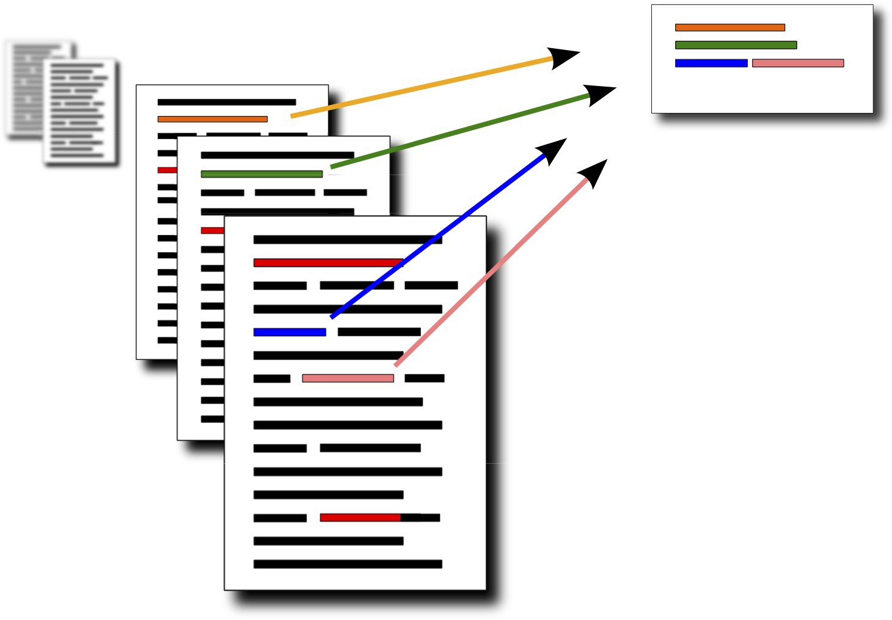

Keywords-Extraction: comparison of models and algorithms.
================

Background
--------

**Keyword/Keyphrase extraction** is the task of extracting important words that are relevant to the underlying document. 
It lets you to enable faster search over documents by indexing them as document alias and 
are even helpful in categorizing a given piece of text for these central topics. 

Experiments
--------
Now, these could be either ***abstractive*** (relevant keywords from outside of the written text) 
or ***extractive*** (relevant keywords present in the written text) in nature.

In this repository, I am going to implement few algorithms for Russian language and 
to perform keyword extraction with five different approaches: TF-IDF, TextRank, TopicRank, YAKE!, and KeyBERT. 

Let’s see who performs better!

Features
--------

* Text summarization
* Keyword extraction

Algorithms (currently implemented)
--------

* TextRank - is a text summarization technique which can be also used for keyword extraction,
with optimizations on the similarity function, [paper](https://arxiv.org/pdf/1602.03606.pdf).

References
-------------
- Mihalcea, R., Tarau, P.:
  ["Textrank: Bringing order into texts"](http://www.aclweb.org/anthology/W04-3252).
  In: Lin, D., Wu, D. (eds.)
  Proceedings of EMNLP 2004. pp. 404–411. Association for Computational Linguistics,
  Barcelona, Spain. July 2004.

- Barrios, F., López, F., Argerich, L., Wachenchauzer, R.:
  ["Variations of the Similarity Function of TextRank for Automated Summarization"](<https://arxiv.org/pdf/1602.03606.pdf>).
  Anales de las 44JAIIO.
  Jornadas Argentinas de Informática, Argentine Symposium on Artificial Intelligence, 2015.
